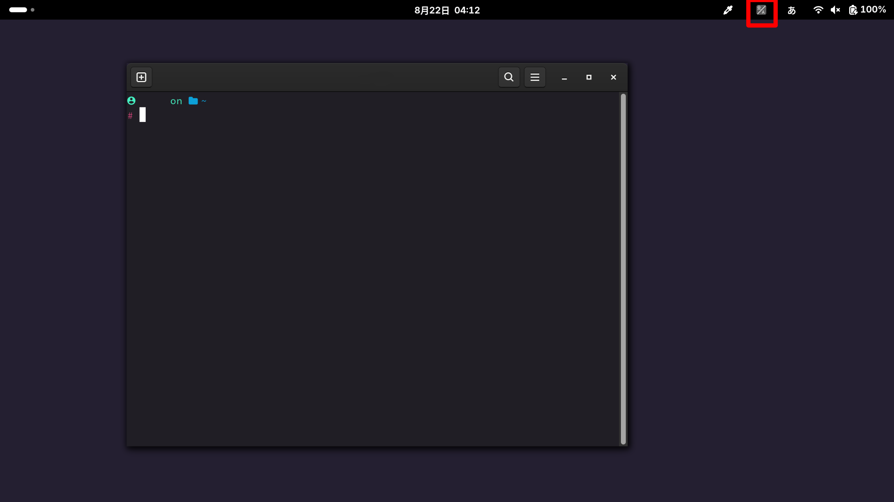

# ZenkakuHankaku-Key (untested other env)
A Gnome extension for wayland and touchpanel environment. Give GNOME users better Japanese input support with GNOME OSK.

# Sample image
 

# supported environment
- GNOME 47 
- Arch Linux
- Mouse and TouchPanel

# Usage(currently only support arch linux env and untested. be careful.)
## required package
- python
- python-uinput
- python-websockets
```bash
yay -S python python-uinput python-websockets
```

## install
```bash
sudo ./install.sh
```
### bug
 Currently the installer can't fix server script path so you need to fix it manually.  
#### fix filepath for server.py (backend)
```bash
# old
ExecStart=/server.py

# new
# "/home/[username]/" should be adjusted depend on your username and home directory path.
ExecStart=/home/[username]/.local/share/gnome-shell/extensions/ZenkakuHankaku-Key@www.nyanmo.info/backend/server.py
```

## uninstall
```bash
sudo ./uninstall.sh
```

## manual installation
### GNOME extension
1. place extention
```bash
cp -r ./extension/ZenkakuHankaku-Key@www.nyanmo.info "${HOME}/.local/share/gnome-shell/extensions/ZenkakuHankaku-Key@www.nyanmo.info"
```

### backend
1. place ZenkakuHankakuKeyd.service 
```bash
# change depend on your linux distribution
SYSTEMD_SERVICE_DIR="/etc/systemd/system/"

sudo cp ./extension/ZenkakuHankaku-Key@www.nyanmo.info/backend/ZenkakuHankakuKeyd.service "${SYSTEMD_SERVICE_DIR}ZenkakuHankakuKeyd.service"
```
2. fix filepath for server.py (backend)
```bash
# old
ExecStart=/server.py

# new
# "/home/[username]/" should be adjusted depend on your username and home directory path.
ExecStart=/home/[username]/.local/share/gnome-shell/extensions/ZenkakuHankaku-Key@www.nyanmo.info/backend/server.py
```
3. enable backend
```bash
sudo systemctl enable --now ZenkakuHankakuKeyd.service 
```

### finalize
 relogin into your account to enable GNOME extension which you manually installed.

# TOOD
- [ ] ExecStart path update on installer
- [ ] explain how to enable extension on GNOME. Default is inactive so user need to enable it manually 
